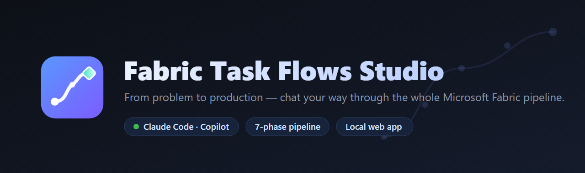
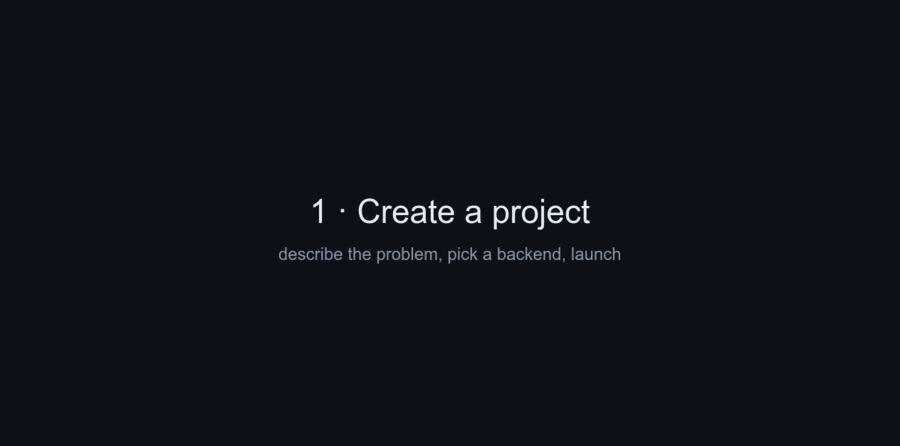
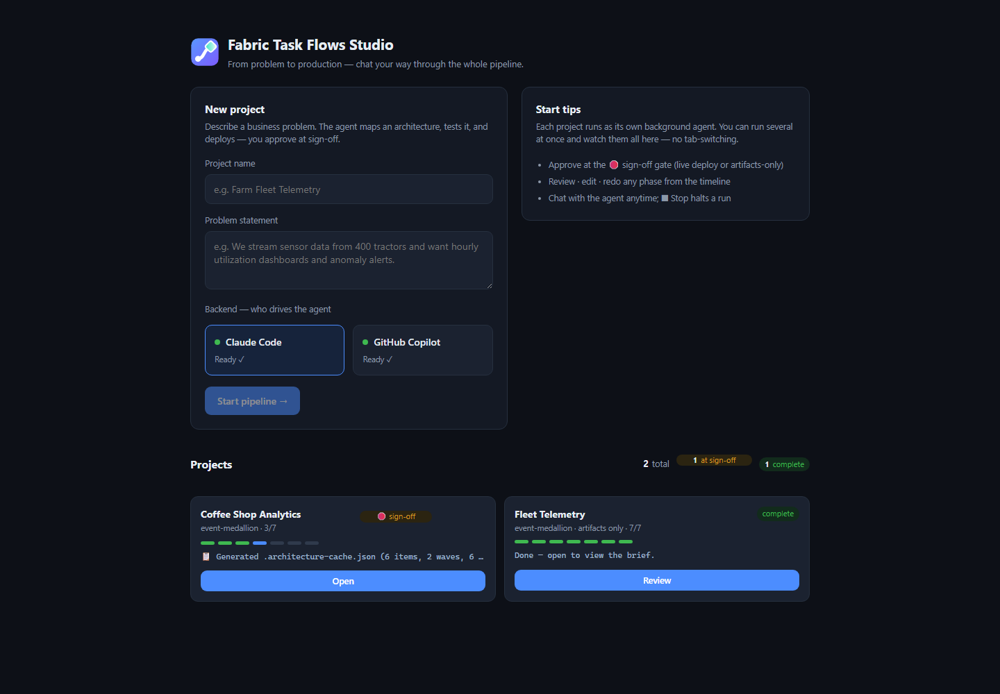
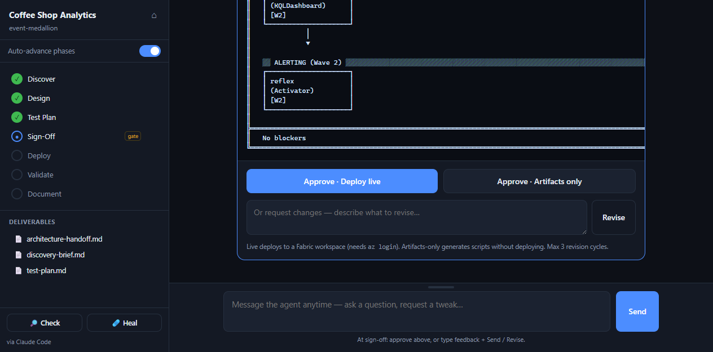
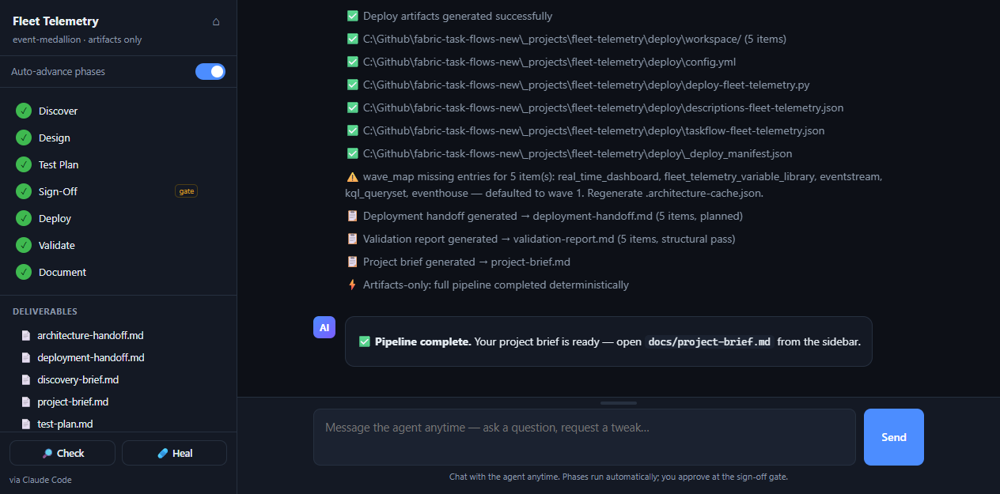
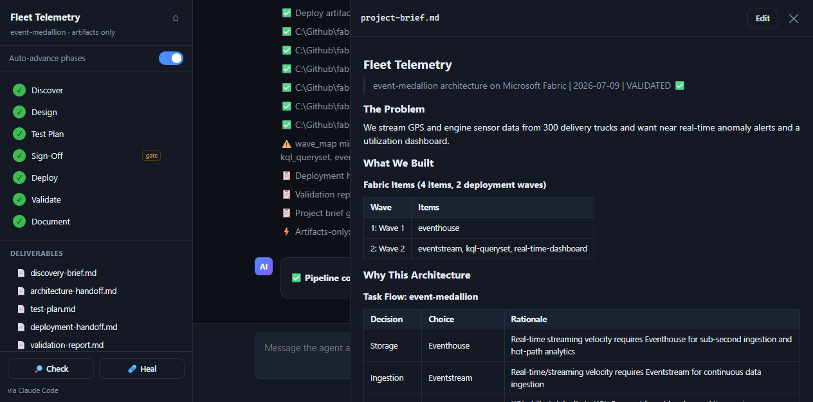

<p align="center">
  
</p>

<p align="center">
  <b>From problem to production — chat your way through the whole Microsoft Fabric pipeline.</b><br/>
  A local web app that drives the <a href="https://github.com/microsoft/fabric-task-flows">Fabric Task Flows</a> pipeline end-to-end with a headless AI agent (<b>Claude Code</b> or <b>GitHub Copilot</b>). You describe the business problem in chat; the agent maps an architecture, tests it, and produces CI/CD-ready deployment artifacts — you just approve at the sign-off gate.
</p>

<p align="center">
  
  
  
  
</p>

> **Fabric Task Flows Studio** is a fork of Microsoft's [**fabric-task-flows**](https://github.com/microsoft/fabric-task-flows) that adds a full chat-driven web UI on top of the same pipeline engine. The original CLI-and-Copilot workflow is untouched and [documented below](#-built-on-microsoft-fabric-task-flows).

<p align="center">
  
</p>
<p align="center"><i>Create a project → watch the agent work · review &amp; edit any phase (auto-advance off) · resume a run anytime.</i></p>

---

## 📸 A quick walkthrough

Describe a problem, watch the agent build the architecture, approve once, and collect your deliverables.

**1 · Start from the dashboard** — enter a project name and a one-line problem, pick a backend, and click **Start pipeline**. You can run several projects at once and watch them all update live.

<p align="center">
  
</p>

**2 · Approve at the 🛑 sign-off gate** — review the architecture diagram and the plain-language summary, then **Approve** (deploy live or artifacts-only), or type feedback to **Revise**.

<p align="center">
  
</p>

**3 · Watch it finish** — the phase timeline fills in and every deliverable lands in the sidebar.

<p align="center">
  
</p>

**4 · Open any deliverable** — read it rendered, or **Edit** it inline and save.

<p align="center">
  
</p>

---

## ✨ Highlights

- **Chat-driven** — describe your problem in plain language; the agent does the rest.
- **Two backends** — pick **Claude Code** or **GitHub Copilot** per project; the app auto-detects what's installed.
- **One human gate** — review the architecture diagram and **Approve** (deploy live or artifacts-only) or **Revise**.
- **Live multi-project dashboard** — run several projects at once as background agents and watch them all update, no tab-switching.
- **Full control** — review / edit / redo any phase, chat anytime, auto-advance toggle, and a **Stop** button that halts a run.
- **Persistent** — each project's transcript and deliverables are saved; reopen and pick up exactly where you left off.

---

## 🚀 Quick start

### Prerequisites

- **Python 3.11+**
- At least one agent backend:
  - **Claude Code** — `npm i -g @anthropic-ai/claude-code` (uses your Claude subscription login)
  - **GitHub Copilot CLI** — `npm i -g @github/copilot`

### Get it

```bash
git clone https://github.com/pugliabi/Fabric-Task-Flow-Studio.git
cd Fabric-Task-Flow-Studio
```

### Run it — one command from the repo root

| Platform | Command |
|----------|---------|
| **Windows** | double-click **`start.bat`** (or run `start.bat` / `fabric-studio` in a terminal) |
| **macOS / Linux** | `./start.sh` |

`start.bat` / `start.sh` create the virtual environment, install dependencies, launch the server, and open **http://127.0.0.1:8000** automatically. First run takes a few seconds to set up; later runs start instantly.

<details>
<summary>Manual / advanced start</summary>

```bash
python -m venv .venv
# Windows:  .venv\Scripts\activate      macOS/Linux:  source .venv/bin/activate
pip install -r app/requirements-app.txt
python run-app.py            # flags: --port 8000  --host 127.0.0.1  --no-reload  --no-browser
```
`run-app.py` also installs FastAPI/uvicorn if they're missing. On **Windows**, the first run registers a **Start Menu** launcher — press <kbd>⊞ Win</kbd> and type *"Fabric Task Flows Studio"*.
</details>

---

## 🧭 How to use it

1. **Describe your problem.** On the home page, enter a project name and a one-paragraph problem statement, pick a backend, and click **Start pipeline**.
2. **Watch it work.** The agent streams its thinking and tool calls into the chat while it discovers signals, selects a task flow, designs the architecture, and writes a test plan. The sidebar timeline shows phase progress.
3. **Approve at the 🛑 sign-off gate.** You get a plain-language summary plus the architecture diagram, and two buttons:
   - **Approve · Deploy live** — generates and runs the deployment against a Fabric workspace (needs `az login`).
   - **Approve · Artifacts only** — generates the CI/CD-ready scripts without deploying.
   - Or type feedback and **Revise** (up to 3 cycles).
4. **Get your deliverables.** Everything lands in the sidebar — `discovery-brief`, `architecture-handoff`, `test-plan`, `deployment-handoff`, `validation-report`, and a synthesized `project-brief`. Click any to read it rendered, or **Edit** it inline.

### The full toolkit

- **Projects dashboard (home)** — a live card per project with a mini 7-phase progress bar, status (● running / 🛑 sign-off / complete / idle), a `3/7` phase count, and the project's **latest activity line** (updates even for background runs). A header strip summarizes running / at-sign-off / complete counts. Polls every ~2.5s (paused when the tab is hidden). Each card has **Open / View live** and, for running ones, **⏹ Stop**.
- **Chat anytime** — the composer is always live. Ask a question or request a tweak; the agent answers in the project's context. With **Claude Code** the session is resumed across turns (`--resume`), so it remembers the conversation.
- **Per-phase actions** — hover any phase in the timeline: 📄 **Review** the deliverable · ✏️ **Edit** it inline and save · ↻ **Redo** from that phase (resets it + later phases and re-runs).
- **Auto-advance toggle** — **On** (default): phases run back-to-back to the sign-off gate. **Off**: pause after each phase to review, then click **Continue**. Gates and completion always stop regardless.
- **Continue** — reopening an in-progress or paused project shows a *Continue pipeline* button that resumes from the current phase.
- **Check / Heal** — *Check* verifies every completed phase's output and state consistency (read-only); *Heal* runs `reconcile` to repair drift from file evidence.
- **Activity indicator** — the instant you do anything, a "*<backend> is working…*" bar appears above the composer and stays until the agent responds — you always know something is processing.
- **Stop** — halt a running flow from the working bar, the sidebar, or a project card. Stop kills the agent's whole process tree, cancels the drive loop, and leaves the phase re-runnable.
- **Persistent chat history** — every project's transcript is saved to `_projects/<p>/.studio/history.jsonl`. Reopen a project (even after a restart) and the full conversation replays, then the live state re-syncs.
- **Resizable chat box** — drag the handle above the composer to resize the message box (double-click to reset; the size is remembered).
- **Pinned layout** — the sidebar (phases + deliverables) and the composer/working bar stay fixed; only the transcript scrolls, so scrolling back never hides them.

### Backends — who drives the agent

Pick one on the start screen (the app auto-detects what's installed):

| Backend | How it's driven | Install |
|---------|-----------------|---------|
| **Claude Code** | `claude -p --output-format stream-json --permission-mode bypassPermissions`. A preamble tells it to read `.github/agents/fabric-advisor.agent.md` + the phase's `SKILL.md` and act as the orchestrator. | `npm i -g @anthropic-ai/claude-code` |
| **GitHub Copilot** | `copilot -p - -s --allow-all-tools --no-ask-user --agent fabric-advisor`. Loads the real `fabric-advisor` agent natively. | `npm i -g @github/copilot` |

> **Claude auth:** the Claude backend uses your **Claude Code subscription login**. If `ANTHROPIC_API_KEY` / `ANTHROPIC_AUTH_TOKEN` is set in your environment, Claude Code would otherwise prefer that pay-as-you-go key (which can fail with *"credit balance too low"*), so the runner strips it from the agent subprocess. Set `FTF_USE_API_KEY=1` to force the API key instead.

### What you get per project

```
_projects/your-project/          (local only — gitignored)
├── docs/                         ← discovery, architecture, test plan, validation, project brief
├── deploy/                       ← CI/CD-ready deployment scripts + workspace definitions
└── .studio/history.jsonl         ← saved chat transcript (so you can pick up where you left off)
```

---

<details>
<summary><h2>🔧 Under the hood (architecture, API, concurrency)</h2></summary>

The Studio wraps the exact same pipeline library the CLI uses (`_shared/scripts/run-pipeline.py`), so pipeline semantics and state ownership are unchanged. The app only **reads** state and docs, calls the same `advance` / `start` functions, and streams everything into a chat UI. The agent's only job per phase is to write that phase's doc file; the app owns every `advance` and the deterministic fast-forward. Nothing edits `pipeline-state.json` except the pipeline library.

### Components

```
start.bat / start.sh       → clone-and-run launchers (venv + deps + run)
run-app.py                 → launcher (ensures deps, forces UTF-8, runs uvicorn)
fabric-studio.bat          → Windows Start Menu launcher
app/
  server.py                → FastAPI: REST + SSE, static serving, in-memory sessions
  orchestrator.py          → the drive loop: run agent per phase → advance → stop at gate
  runners.py               → AgentRunner + ClaudeCodeRunner / CopilotRunner, backend detection
  pipeline_api.py          → thin wrapper over _shared/lib (start/advance/status/prompts/docs)
  static/                  → self-contained chat UI + favicon
```

### What happens in a run

1. **Start** → project is scaffolded, signal mapper runs.
2. **Discover** → the agent writes `docs/discovery-brief.md`. The app advances, which deterministically fast-forwards Design + Test Plan and lands on the gate.
3. **Sign-off (human gate)** → the app shows the diagram + summary and the approve/revise controls.
4. **Artifacts-only** → the app fast-forwards Deploy → Validate → Document deterministically → **complete**. **Live** → the agent runs the deploy / validate / document phases.

### Concurrency — multiple projects at once

Each project is an independent `Session` with its own agent process and event stream, so several run **in parallel**. The agent CLIs run in worker threads, and the synchronous pipeline-library calls (which spawn their own generator subprocesses) are offloaded off the event loop via `asyncio.to_thread`, serialized by a lock because that library isn't thread-safe. One project's phase running never freezes the UI for the others.

> Browser note: HTTP/1.1 allows ~6 live connections per origin and each open project tab holds one SSE connection, so keep it to a handful of simultaneous tabs (the dashboard lets you watch many from a single connection).

### How the chat stream works

Each session fans events out to per-connection subscribers backed by a bounded event log. The `/api/projects/{p}/events` SSE endpoint replays what a (re)connecting client missed via `Last-Event-ID`, then streams live `data: {json}` frames — so reconnects never duplicate or drop messages.

### API reference

| Method | Path | Purpose |
|--------|------|---------|
| GET  | `/api/backends` | Which CLIs are installed |
| GET  | `/api/projects` | All projects + live status (running, phase, activity) |
| POST | `/api/start` | `{name, problem, backend}` → scaffold + start driving |
| POST | `/api/projects/{p}/resume` | `{backend}` → re-drive / continue |
| POST | `/api/projects/{p}/approve` | `{deploy_mode: live\|artifacts_only}` |
| POST | `/api/projects/{p}/revise` | `{feedback}` |
| POST | `/api/projects/{p}/chat` | `{message}` → chat with the agent |
| POST | `/api/projects/{p}/reset` | `{phase, rerun}` → go back / redo a phase |
| POST | `/api/projects/{p}/mode` | `{auto_advance}` → pacing toggle |
| POST | `/api/projects/{p}/check` | `{heal}` → verify (and optionally reconcile) |
| POST | `/api/projects/{p}/stop` | halt a running flow |
| GET  | `/api/projects/{p}/status` | current state + phases + docs |
| GET  | `/api/projects/{p}/doc?name=` | read one `docs/*.md` |
| POST | `/api/projects/{p}/doc` | `{name, content}` → save an edited deliverable |
| GET  | `/api/projects/{p}/events` | SSE chat stream (supports `Last-Event-ID`) |

Deep-link: `?open=<project>` opens a project directly; add `&doc=<file.md>` to open a deliverable.

### Notes

- **UTF-8 is forced** (`PYTHONUTF8`) — Windows cp1252 otherwise corrupts box/arrow glyphs in diagrams and agent output.
- Sessions live in memory and reset when the server restarts — pipeline state and the saved transcript on disk are the source of truth, so just reopen the project.
- Live deployment still requires `az login` in your own terminal, exactly as the CLI does.

</details>

---

## 🏗️ Built on Microsoft Fabric Task Flows

The Studio is a UI layer over Microsoft's **[fabric-task-flows](https://github.com/microsoft/fabric-task-flows)** — the same `@fabric-advisor` agent, skills, registries, and templates power everything under the hood. The original workflow (drive the pipeline from the CLI + Copilot chat) still works exactly as before.

| Resource | Description |
|----------|-------------|
| [**13 Task Flows**](task-flows.md) | Pre-defined architectures — batch, streaming, hybrid, ML, API, governance, and more |
| [**7 Decision Guides**](decisions/_index.md) | Opinionated guidance on the choices that matter |
| [**Deployment Diagrams**](diagrams/_index.md) | Visual maps showing how pieces connect and deploy in order |
| [**Item Registry**](_shared/registry/item-type-registry.json) | 45 Fabric item types with API paths, CI/CD strategies, and deployment order |
| [**Templates**](_shared/templates/) | Definition files for every deployable Fabric item type |
| [**Workflow Guide**](_shared/workflow-guide.md) | The full CLI pipeline reference (`run-pipeline.py`) |

### Repository structure

```
start.bat / start.sh    → clone-and-run launchers for the Studio  ★ this fork
app/                    → Fabric Task Flows Studio (the web app)   ★ this fork
run-app.py              → Studio launcher
.github/agents/         → The @fabric-advisor orchestrator
.github/skills/         → Composable skills for each phase
decisions/              → Decision guides (the "why" behind each choice)
diagrams/               → Deployment diagrams (how pieces connect)
_shared/registry/       → Canonical registries the agent uses
_shared/templates/      → Starting point templates
_shared/lib/            → Shared Python modules
_shared/scripts/        → Pipeline CLI tools
_shared/tests/          → Test suite
_projects/              → Your project workspaces (gitignored)
```

---

## Contributing & License

Contributions welcome — especially to the **[Item Type Registry](_shared/registry/item-type-registry.json)**. See [CONTRIBUTING.md](CONTRIBUTING.md).

Licensed [MIT](LICENSE). Original project © Microsoft. Studio additions maintained in this fork.
